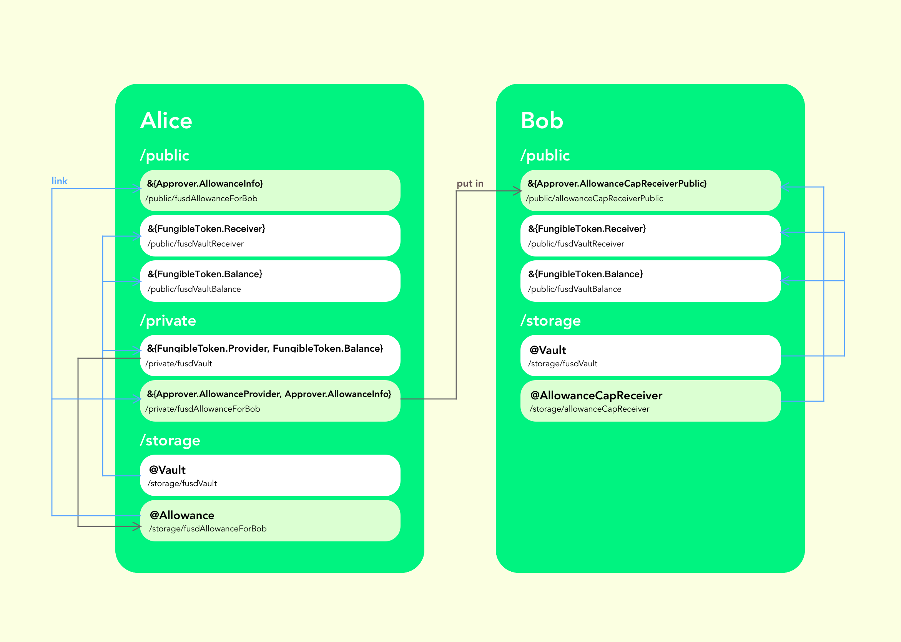

# flow-approver

`Approver` aims to implement ERC20-like `approve` and `transferFrom` mechanism on Flow.

There are two resources defined in this contract:

- `Allowance`: This resource defines the allowance value approved to spender, and wraps a `Capability` of `Vault` (`Capability<&{FungibleToken.Provider, FungibleToken.Balance}>`) in it. Some checks would be run in `Allowance` before the spender spend the fund. The `Allowance` conforms to these interfaces:
    
    ```cadence
    pub resource interface AllowanceInfo {
        pub var value: UFix64
        pub fun getVaultOwner(): Address
    }
    
    pub resource interface AllowanceProvider {
        pub fun withdraw(amount: UFix64): @FungibleToken.Vault
    }
    
    pub resource interface AllowanceManager {
        pub fun setAllowance(value: UFix64)
    }
    ```
    
- `AllowanceCapReceiver`:  The spender must set up this resource. The approver need to send the `Capability` of `Allowance` (`Capability<&{AllowanceProvider, AllowanceInfo}>`) to this receiver, so that the spender can spend the fund. `AllowanceCapReceiver` conforms to this interface:
    
    ```cadence
    pub resource interface AllowanceCapReceiverPublic {
        pub fun addAllowanceCap(_ allowance: Capability<&{AllowanceProvider, AllowanceInfo}>)
        pub fun getAllowanceCapsInfoByApprover(_ approver: Address): [&{AllowanceInfo}]
    }
    ```
    

If Alice wants to approve her FUSD fund for Bob to spend. The process might be:

- Bob set up an `AllowanceCapReceiver`:
    
    ```cadence
    import FUSD from "../contracts/FUSD.cdc"
    import FungibleToken from "../contracts/FungibleToken.cdc"
    import Approver from "../contracts/Approver.cdc"
    
    transaction {
        prepare(signer: AuthAccount) {
            if signer.borrow<&Approver.AllowanceCapReceiver>(from: Approver.AllowanceCapReceiverStoragePath) != nil {
                return
            }
    
            signer.save(
                <- Approver.createAllowanceCapReceiver(), 
                to: Approver.AllowanceCapReceiverStoragePath
            )
    
            signer.link<&{Approver.AllowanceCapReceiverPublic}>(
                Approver.AllowanceCapReceiverPubPath, 
                target: Approver.AllowanceCapReceiverStoragePath
            )
        }
    }
    ```
    
- Alice approves her fund to Bob:
    
    ```cadence
    import FUSD from "../contracts/FUSD.cdc"
    import FungibleToken from "../contracts/FungibleToken.cdc"
    import Approver from "../contracts/Approver.cdc"
    
    transaction(spender: Address, value: UFix64) {
        let allowanceCap: Capability<&{Approver.AllowanceProvider, Approver.AllowanceInfo}>
    
        prepare(signer: AuthAccount) {
            signer.link<&{FungibleToken.Provider, FungibleToken.Balance}>(/private/fusdVault, target: /storage/fusdVault)
            let vaultCap = signer.getCapability<&{FungibleToken.Provider, FungibleToken.Balance}>(/private/fusdVault)!
    
            let allowance <- Approver.createAllowance(
                value: value, 
                vaultCap: vaultCap
            )
    
            let pathID = "fusdAllowanceFor".concat(spender.toString())
            let storagePath = StoragePath(identifier: pathID)!
            let publicPath = PublicPath(identifier: pathID)!
            let privatePath = PrivatePath(identifier: pathID)!
    
            signer.save(<- allowance, to: storagePath)
    
            signer.link<&{Approver.AllowanceInfo}>(publicPath, target: storagePath)
    
            signer.link<&{Approver.AllowanceProvider, Approver.AllowanceInfo}>(
                privatePath, 
                target: storagePath
            )
    
            self.allowanceCap = signer.getCapability<&{Approver.AllowanceProvider, Approver.AllowanceInfo}>(privatePath)
        }
    
        execute {
            let receiver = getAccount(spender).getCapability<&{Approver.AllowanceCapReceiverPublic}>(
                Approver.AllowanceCapReceiverPubPath).borrow()
                ?? panic("Could not borrow AllowanceCapReceiver capability")
    
            receiver.addAllowanceCap(self.allowanceCap)
        }
    }
    ```
    
- Bob spends the fund of Alice:
    
    ```cadence
    import FUSD from "../contracts/FUSD.cdc"
    import FungibleToken from "../contracts/FungibleToken.cdc"
    import Approver from "../contracts/Approver.cdc"
    
    transaction(from: Address, to: Address, value: UFix64) {
        let capReceiver: &Approver.AllowanceCapReceiver
    
        prepare(signer: AuthAccount) {
            self.capReceiver = signer.borrow<&Approver.AllowanceCapReceiver>(from: Approver.AllowanceCapReceiverStoragePath)
                ?? panic("Could not borrow AllowanceCapReceiver reference")
        }
    
        execute {
            let vaultReceiver = getAccount(to).getCapability<&{FungibleToken.Receiver}>(/public/fusdReceiver).borrow()
                ?? panic("Could not get Receiver capability")
    
            let cap = self.capReceiver.getAllowanceCapsByApprover(from)[0]
            vaultReceiver.deposit(from: <- cap.borrow()!.withdraw(amount: value))
        }
    }
    ```
    
- Alice can change the allowance to Bob if she wants:
    
    ```cadence
    import Approver from "../contracts/Approver.cdc"
    
    transaction(spender: Address, value: UFix64) {
        prepare(signer: AuthAccount) {
            let pathID = "fusdAllowanceFor".concat(spender.toString())
            let storagePath = StoragePath(identifier: pathID)!
    
            let allowance = signer.borrow<&Approver.Allowance>(from: storagePath)
                ?? panic("Could not borrow Allowance reference")
    
            allowance.setAllowance(value: value)
        }
    }
    ```
    
- Alice can cancel the allowance to Bob if she wants:
    
    ```cadence
    transaction(spender: Address) {
        prepare(signer: AuthAccount) {
            let pathID = "fusdAllowanceFor".concat(spender.toString())
            let privatePath = PrivatePath(identifier: pathID)!
            let publicPath = PublicPath(identifier: pathID)!
    
            signer.unlink(privatePath)
            signer.unlink(publicPath)
        }
    }
    ```
    
- Alice can recover the allowance to Bob if she wants:
    
    ```cadence
    import Approver from "../contracts/Approver.cdc"
    
    transaction(spender: Address) {
        prepare(signer: AuthAccount) {
            let pathID = "fusdAllowanceFor".concat(spender.toString())
            let storagePath = StoragePath(identifier: pathID)!
            let privatePath = PrivatePath(identifier: pathID)!
            let publicPath = PublicPath(identifier: pathID)!
    
            signer.link<&{Approver.AllowanceProvider, Approver.AllowanceInfo}>(privatePath, target: storagePath)
            signer.link<&{Approver.AllowanceInfo}>(publicPath, target: storagePath)
    
            signer.getCapability<&{Approver.AllowanceProvider, Approver.AllowanceInfo}>(privatePath).borrow()
                ?? panic("Could not get private {AllowanceProvider, AllowanceInfo} capability")
            signer.getCapability<&{Approver.AllowanceInfo}>(publicPath).borrow()
                ?? panic("Could not get public {AllowanceInfo} capability")
        }
    }
    ```
    
- The allowance for a specific pair of approver/spender can be checked by:
    
    ```cadence
    import Approver from "../contracts/Approver.cdc"
    
    pub struct AllowanceInfo {
        pub let value: UFix64
        pub let vaultOwner: Address
    
        init(value: UFix64, vaultOwner: Address) {
            self.value = value
            self.vaultOwner = vaultOwner
        }
    }
    
    pub fun main(approver: Address, spender: Address): AllowanceInfo {
        let path = PublicPath(identifier: "fusdAllowanceFor".concat(spender.toString()))!
        let info = getAccount(approver)
            .getCapability<&{Approver.AllowanceInfo}>(path)
            .borrow() ?? panic("Could not borrow AllowanceInfo capability")
    
        return AllowanceInfo(value: info.value, vaultOwner: info.getVaultOwner())
    }
    ```
    
    or
    
    ```cadence
    import Approver from "../contracts/Approver.cdc"
    
    pub struct AllowanceInfo {
        pub let value: UFix64
        pub let vaultOwner: Address
    
        init(value: UFix64, vaultOwner: Address) {
            self.value = value
            self.vaultOwner = vaultOwner
        }
    }
    
    pub fun main(approver: Address, spender: Address): [AllowanceInfo] {
        let receiver = getAccount(spender)
            .getCapability<&{Approver.AllowanceCapReceiverPublic}>(Approver.AllowanceCapReceiverPubPath)
            .borrow() 
            ?? panic("Could not borrow AllowanceCapReceiverPublic capability")
    
        let infos: [AllowanceInfo] = []
        for i in receiver.getAllowanceCapsInfoByApprover(approver) {
            infos.append(
                AllowanceInfo(value: i.value, vaultOwner: i.getVaultOwner())
            )
        }
    
        return infos
    }
    ```

The storage of Alice and Bob might be like this:

